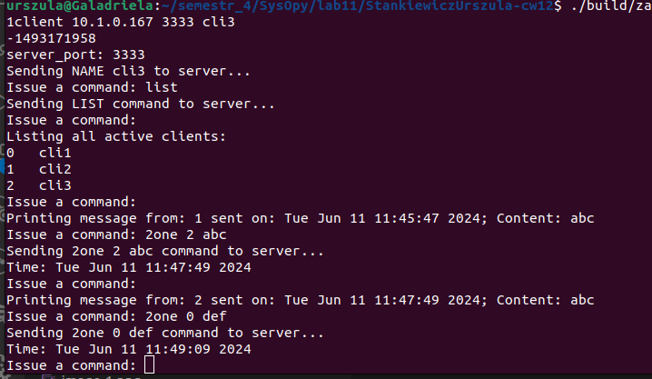
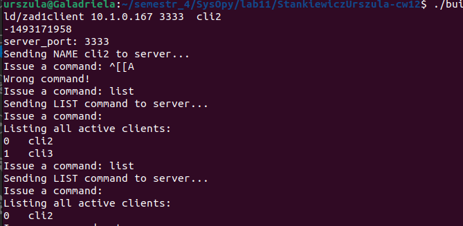

W celu kompilacji odpowiednich podpunktów należy postępować następująco:
- make zad1 kompiluje zadanie 1 (klienta oraz serwer)

# Testowanie rozwiązań
zad1: Uruchamiamy ./build/zad1server z argumentami ADRES i PORT. Jeśli uruchomimy z argumentami NULL NULL, serwer sam wybierze adres i port, które zostaną wyświetlone w terminalu. Następnie w kilku terminalach uruchamiamy ./build/zad1client ADRES PORT_SERWERA NAZWA. ADRES i PORT_SERWERA powinny być takie same jak w serwerze. Serwer zapamięta nazwy klientów. Komenda `list` zwróci klientowi na jego standardowe wyjście listę wszystkich aktywnych klientów (numer indeksu w tablicy i nazwa). Komenda `2all STRING` wyśle do wszystkich klientów wiadomość STRING, `2one ID STRING` wyśle do klienta o indeksie ID wiadomość STRING, `STOP` wyrejestruje klienta z serwera i zakończy jego działanie, `ALIVE` rozpocznie wysyłanie do klienta informacji o zarejestrowanych klientach, `END_ALIVE` zakończy wysyłanie tych wiadomości. Przykładowe działanie:
# a) komenda LIST
          

# b) komenda 2all

- wysyłający cl2  
   
- odbiera wiadomość cl1  
    
- odbiera wiadomość cl3  
   

# c) komenda 2one
- cl3 wysyła wiadomość def do cl1:     
  
- cl1 odbiera wiadomość:    
  
- cl2 nie odbiera wiadomości:    
  

# d) Komenda alive
- cl1, cl2 wysyłają  komendę alive - w jej wyniku są co 5 sekund powiadamiani o statusie  aktywności klientów zarejestrowanych    
  
  
- komenda end_alive w cl1 zatrzymuje wysyłanie updatów o klientach do cl1, ale nie do cl2:  
  - cl1:   
  
  - cl2:   
    
- zatrzymam teraz cl1 komendą ctrl+Z:       
  
- w cl2 zaobserwowaliśmy usunięcie cl1:    
  
- zobaczmy co się stanie jeśli wykonamy komendę STOP w cl3:   
  - cl3:  
      
  - cl2:   
        
    Jak widać, tym razem klient sam się wyrejestrował z serwera, dlatego nie otrzymaliśmy komunikatu o jego usunięciu.
# e) Ctrl+C:   
Uruchommy klientów cl2, cl3 jeszcze raz i zobaczmy co się stanie po wciśnięciu ctrl+c:
- przed ctrl+c   
  
  
- po ctrl+c na kliencie cl3 - działa tak samo jak STOP:   
  
  

